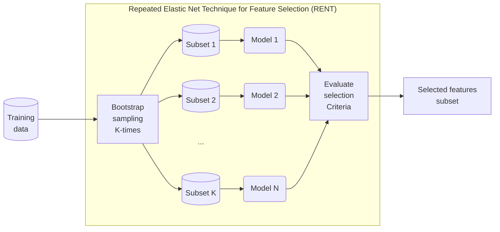
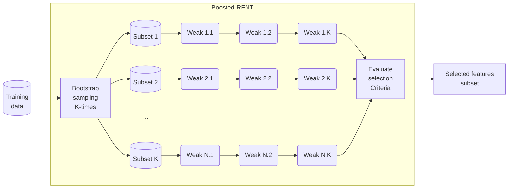
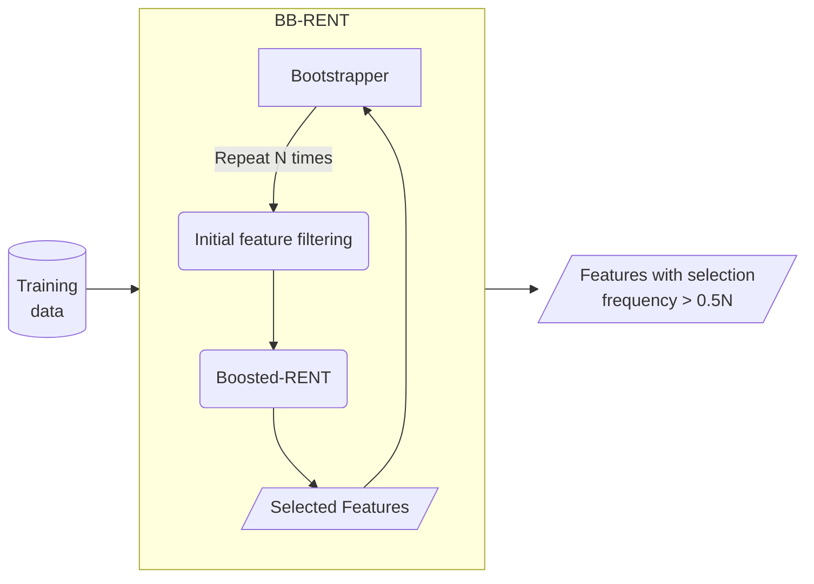

# BB-RENT

## Explanation for the Repeated Elastic Net Technique (RENT)

Based on the idea of ensembles, the authors focused the distribution of features weights (i.e., coefficients) of elastic net regularized models. The criteria for features selection in RENT were based on:

1. How often is a features selected? ($\tau_1$)
2. To which degree do the feature weights alternate between positive and negative values? ($\tau_2$)
3. Are feature weights significantly unequal to 0? ($\tau_3$)

## Original RENT[^1]



### Weakness

The selection power of this method wasn't enough, after the initial filtering, the features left all have strong t-test performance between the two class.  The three selection criteria wasn't enough as the coefficients of the remaining features all showed high $\tau_1$ and $\tau_3$. Although $\tau_2$ can be used to filter away around 60% of features, different features were kept each time RENT is performed on the bootstrapped dataset (i.e. different data from the same set is giving different feature set).

Also, it is not rare that the some of the repeated elastic net models trained couldn't converge, but the features from these unconverged runs were still included by RENT. While this is related to the non-optimal alpha and L1-ratio, this is still problematic.

> **Notes:** Later it is found that while `RENT_Classification` showed unstableness, `RENT_Regression` seems to show better selection stability. However, when the outer K-fold is repeated again, the selected features were not always the same. Furthermore, after the features were recalculated from the original data together with some added features, the selected features changes, so it is still sensitive to the data some how but more stable than doing nothing. Therefore, we proposed to boost the elastic net prior to evaluating the three selection criteria.

### Usage

```python
from RENT import RENT
# Define setting for RENT
model = RENT.RENT_Classification(data=train_data, 
                                 target=train_labels, 
                                 feat_names=train_data.columns, 
                                 C=[10], # 1/alpha; needs to be a list
                                 l1_ratios=[0.5], # needs to be a list
                                 autoEnetParSel=False, # if not set to false the C/L1 list is permuted
                                 poly='OFF',
                                 testsize_range=(0.25,0.25),
                                 scoring='mcc',
                                 classifier='logreg',
                                 K=100,
                                 random_state=0,
                                 verbose=1)
model.train()
selected_features = model.select_features(tau_1_cutoff=0.9, tau_2_cutoff=0.9, tau_3_cutoff=0.975)
```


## Modifying and implementing BB-RENT

First the original RENT is modified such that instead of running the elastic net on each bootstrapped subset once, the boosted elastic net is used. 



Then, the Boosted-RENT is used multiple times on the bootstrapped subset of the training data, which then becomes the bagged-boosted RENT (BB-RENT)



### Usage

TODO