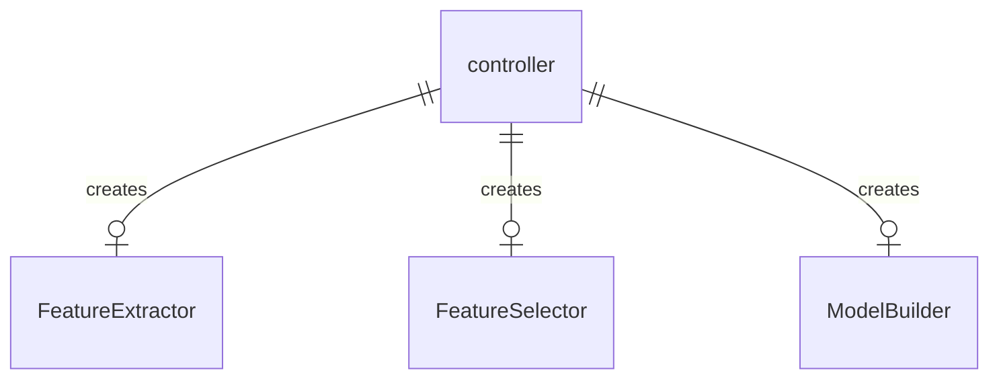
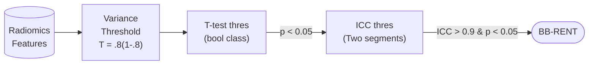

# Index

[TOC]

# Briefing



This repo is a python toolkit written to run radiomics analysis in a pipeline. This includes radiomic feature extraction, selection, then model building on the selected features. The code in written in a way such that the pipeline is controlled by the a `controller` instance. This instance can be created from scratch following the specification of 1) PyRadiomics extraction setting and 2) controller initialization settings.  These instance have save/load function such that once trained, they can be loaded by others to perform inference.

In addition, this repo introduces a feature selection technique combing boosting and bagging together with RENT, a previously proposed technique to improve feature stability. (Figure 1)

 

# Installation

Clone and install MNTS

```sh
pip install git+https://github.com/alabamagan/mri_normalization_tools
```

Clone this repository

```shell
git clone --recursive https://github.com/alabamagan/mri_radiomics_toolkit
```

Install the forked RENT

```sh
cd mri_radiomics_toolkit/ThirdPartyRENT
pip install .
```

Install this package

```sh
cd ../..
pip install .
```


# Usage

## Feature extractor

### Functionalities

* Extract features according to the PyRadiomics setting
* Allow special extraction pipeline such as extract the features slice-by-slice, or from various class of labels
* Save/Load states
* Write extracted features into formatted excel
* Allow augmentation of data before feature extraction

### Usage

```python
from mri_radiomics_toolkit import *

p_im = Path("data/image")
p_seg = Path("data/segmentation")
p_param = Path("pyrad_setting.yml")
id_globber = "^[0-9]+" # glob the unique ID from the image file name 

fe = FeatureExtractor(id_globber=id_globber, 
                      idlist=['100', '101', '102']) # only perform on these three cases
df = fe.extract_features(p_im, p_seg, param_file=p_param)
fe.save_features("saveout.xlsx") # write results here, columns are the cases
fe.save("extractor_state.fe") # for using this directly during inference
```


## Feature Selector

This package includes a feature selection method modified on top of the RENT algorithm, incorporating the combination of boosting and bagging, called BB-RENT.



### Functionalities

* Select features from excel of extracted features
* Automatically ignore 'diagnostics' column
* Uses BB-RENT
* Save/Load states
* Allow hyperparms tunning based on criteria_threshold and other settings

### Usage

```python
from mri_radiomics_toolkit import *
import pandas as pd

p_feat_a = Path('samples_feat_1st.xlsx')
p_feat_b = Path('samples_feat_2nd.xlsx')
p_gt = Path('sample_datasheet.csv')

# For feature selection, rows needs to be cases and columns are the features
features_a = pd.read_excel(str(p_feat_a), index_col=[0, 1, 2]).T
features_b = pd.read_excel(str(p_feat_b), index_col=[0, 1, 2]).T
gt = pd.read_csv(str(p_gt), index_col=0)

# make sure the input feature and the ground-truth datasheet has the same batch of cases
cases = set(features_a.index) & set(gt.index)
gt = gt.loc[cases]	# need this to keep the order of rows aligned with features

# Create feature selector
fs = FeatureSelector(n_trials=20, boot_runs=5,
                     criteria_threshold=[0.1, 0.1, 0.1],
                     thres_percentage=0.2,
                     boosting=True) # Use default criteria, test with boosting
feats = fs.fit(features_a, gt)	# This could take hours
selected_features = fs.selected_features # also stored in this attribute

# Save for inferences
fs.save("features_selected.fs")

# use this function to get the features after loading
fs.load("features_selected.fs")
fs.predict(features_a.T)
```

