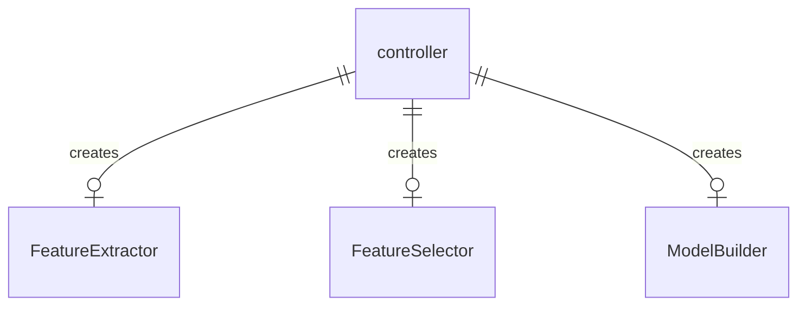
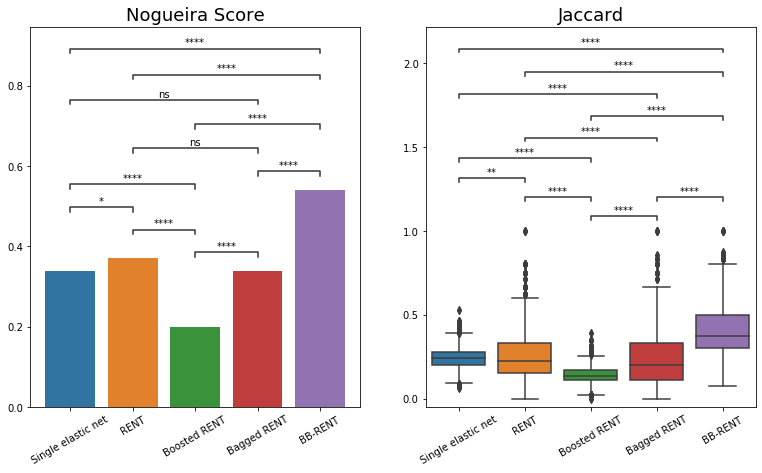

# Index

[TOC]

# Briefing



This repo is a python toolkit written to run radiomics analysis in a pipeline. This includes radiomic feature extraction, selection, then model building on the selected features. The code in written in a way such that the pipeline is controlled by the a `controller` instance. This instance can be created from scratch following the specification of 1) PyRadiomics extraction setting and 2) controller initialization settings.  These instance have save/load function such that once trained, they can be loaded by others to perform inference.

In addition, this repo introduces a feature selection technique combing boosting and bagging together with RENT, a previously proposed technique to improve feature stability. (Figure 1)



# Installation

Clone reprositories

git clone --recursive https://github.com/alabamagan/mri_radiomics_toolkit
Install mnts

```bash
cd mri_radiomics_toolkits/ThirdParty/mnts
pip install .
cd -
```
Install the forked RENT

```bash
cd mri_radiomics_toolkit/ThirdPartyRENT
pip install .
cd -
```
Install this package

```sh
cd ../..
pip install .
```
# Usage

## Feature extractor

### Functionalities

* Extract features according to the PyRadiomics setting
* Allow special extraction pipeline such as extract the features slice-by-slice, or from various class of labels
* Save/Load states
* Write extracted features into formatted excel
* Allow augmentation of data before feature extraction

### Usage (API)

```python
from mri_radiomics_toolkit import *

p_im = Path("data/image")
p_seg = Path("data/segmentation")
p_param = Path("pyrad_setting.yml")
id_globber = "^[0-9]+" # glob the unique ID from the image file name 

fe = FeatureExtractor(id_globber=id_globber, 
                      idlist=['100', '101', '102']) # only perform on these three cases
df = fe.extract_features(p_im, p_seg, param_file=p_param)
fe.save_features("saveout.xlsx") # write results here, columns are the cases
fe.save("extractor_state.fe") # for using this directly during inference
```
### Usage (Console)

An entry point for the script `scripts/run_pyradiomics.py` can be accessed through the command `mradtk-extract-features`

```bash
usage: mradtk-extract-features [-h] [-i IMG_DIR] [-s SEG_DIR] [-p PARAM_FILE] [-f WITH_NORM] [-g ID_GLOBBER] [-o OUTPUT] [-v--verbose] [--id-list ID_LIST] [--keep-log]

optional arguments:
  -h, --help            show this help message and exit
  -i IMG_DIR, --img-dir IMG_DIR
                        Directory to image files.
  -s SEG_DIR, --seg-dir SEG_DIR
                        Directory to segmentation files.
  -p PARAM_FILE, --param-file PARAM_FILE
                        Path to the pyradiomics settings.
  -f WITH_NORM, --with-norm WITH_NORM
                        If specified path to a normalization state-dir, extract_feature_with_norm will be called.
  -g ID_GLOBBER, --id-globber ID_GLOBBER
                        Regex ID globber for pairing images and segmentation.
  -o OUTPUT, --output OUTPUT
                        Where to output the computed features as excel.
  -v--verbose           Verbosity option.
  --id-list ID_LIST     If specificied pass this to feature extractor.
  --keep-log            If true, the log file is saved to "pyradiomics.log"
/home/lwong/Toolkits/Anaconda/envs/radiomics/lib/python3.8/site-packages/outdated/utils.py:14: OutdatedCheckFailedWarning: Failed to check for latest version of package.
```
#### `IMG_DIR`

Directory where the target nifty images are. All the files with a suffix `.nii.gz` will be scanned and included. You can specify `ID_GLOBBER` and `ID_LIST` to fine tune this behavior.

#### `SEG_DIR`

Directory where the segmentations are. Also needs to be `.nii.gz` files. The program will automatically tries to compute the overlap between the images and the segmentation based on the `ID_GLOBBER` result. Only the intersection will be processed (i.e., IDs that exists in both the image directory and the segmentation directory)

#### `ID_GLOBBER`

This packages uses an ID globbed from each file name to pair the images and segmentation. This option is a regex pattern that will allow you to glob the ID from the file name excluding the suffix ".nii.gz". For example, if you have files named `001_T1w.nii.gz` and `001_seg.nii.gz`, you can pair up these tow file by specifying the globber regex as something like `"^\d+"`.

#### `ID_LIST`

If you don't want to run all the images within `IMG_DIR`, you can use this option to specify the data to load. Currently there are two methods to set this option. First, explicity definition with comma separated string, e.g., `--id-list "001,002,003"`. The program will then only extract the features from the data with ID globbed as one `001`, `002`, and `003`.

#### `KEEP_LOG`

This program uses the logger from `mntk` for logging. This could be annoying for some as if it breaks the logging system. By default, it creats a temp log file to hold all the outputs, but this temp file will be destroyed together with the main process. Use this option to prevent it.

## Feature Selector

This package includes a feature selection method modified on top of the RENT algorithm, incorporating the combination of boosting and bagging, called BB-RENT.


### Functionalities

* Select features from excel of extracted features
* Automatically ignore 'diagnostics' column
* Uses BB-RENT
* Save/Load states
* Allow hyperparms tunning based on criteria_threshold and other settings

### Usage

```python
from mri_radiomics_toolkit import *
import pandas as pd

p_feat_a = Path('samples_feat_1st.xlsx')
p_feat_b = Path('samples_feat_2nd.xlsx')
p_gt = Path('sample_datasheet.csv')

# For feature selection, rows needs to be cases and columns are the features
features_a = pd.read_excel(str(p_feat_a), index_col=[0, 1, 2]).T
features_b = pd.read_excel(str(p_feat_b), index_col=[0, 1, 2]).T
gt = pd.read_csv(str(p_gt), index_col=0)

# make sure the input feature and the ground-truth datasheet has the same batch of cases
cases = set(features_a.index) & set(gt.index)
gt = gt.loc[cases]	# need this to keep the order of rows aligned with features

# Create feature selector
fs = FeatureSelector(n_trials=20, boot_runs=5,
                     criteria_threshold=[0.1, 0.1, 0.1],
                     thres_percentage=0.2,
                     boosting=True) # Use default criteria, test with boosting
feats = fs.fit(features_a, gt)	# This could take hours
selected_features = fs.selected_features # also stored in this attribute

# Save for inferences
fs.save("features_selected.fs")

# use this function to get the features after loading
fs.load("features_selected.fs")
fs.predict(features_a.T)
```
# DataFrame convention

In this packages, the features data frame are generally configured with rows being each unique feature and columns being the data points (patients). The index typically has three levels `{1: 'Pre-processing', 2: 'FeatureGroup', 3: 'Feature_Name')`. The index is generally `pd.MultiIndex`, but sometimes, its converted to single level index `pd.Index` by maping `'_'.join`.

## Convention for most internal operations

```
+----------------+---------------+----------------------------------+-----------+-----------+-----------+
| Pre-processing | Feature_Group |           Feature_Name           | Patient 1 | Patient 2 | Patient 3 |
+================+===============+==================================+===========+===========+===========+
|    original    |     shape     | Elongation                       | 0.736071  | 0.583376  | 0.842203  |
+                +               +----------------------------------+-----------+-----------+-----------+
|                |               | Maximum2DDiameterSlice           | 38.69644  | 40.13999  | 42.83211  |
+                +               +----------------------------------+-----------+-----------+-----------+
|                |               | Maximum3DDiameter                | 39.47085  | 53.00941  | 44.86157  |
+                +---------------+----------------------------------+-----------+-----------+-----------+
|                |   firstorder  | 10Percentile                     | 80        | 84        | 131       |
+                +               +----------------------------------+-----------+-----------+-----------+
|                |               | 90Percentile                     | 167       | 198       | 221       |
+                +               +----------------------------------+-----------+-----------+-----------+
|                |               | Mean                             | 125.0034  | 141.5715  | 177.9713  |
+                +               +----------------------------------+-----------+-----------+-----------+
|                |               | Median                           | 126       | 143       | 182       |
+                +---------------+----------------------------------+-----------+-----------+-----------+
|                |      glcm     | Autocorrelation                  | 32.9823   | 42.24437  | 60.84951  |
+                +               +----------------------------------+-----------+-----------+-----------+
|                |               | ClusterProminence                | 201.2033  | 370.5453  | 213.6482  |
+                +               +----------------------------------+-----------+-----------+-----------+
|                |               | ClusterShade                     | 3.085583  | -2.73874  | -7.56395  |
+                +---------------+----------------------------------+-----------+-----------+-----------+
|                |     glrlm     | GrayLevelNonUniformity           | 3828.433  | 5173.855  | 6484.706  |
+                +               +----------------------------------+-----------+-----------+-----------+
|                |               | RunVariance                      | 5.13809   | 2.925426  | 5.239695  |
+                +               +----------------------------------+-----------+-----------+-----------+
|                |               | ShortRunEmphasis                 | 0.574203  | 0.629602  | 0.545728  |
+                +               +----------------------------------+-----------+-----------+-----------+
|                |               | ShortRunHighGrayLevelEmphasis    | 18.43039  | 25.55685  | 32.46986  |
+                +               +----------------------------------+-----------+-----------+-----------+
|                |               | ShortRunLowGrayLevelEmphasis     | 0.03399   | 0.030848  | 0.012844  |
+----------------+---------------+----------------------------------+-----------+-----------+-----------+
```
## Convention in fit()

Regardless, the `fit()` function implemented in this package usually follows `scipy` and `sklearn` convention, where rows are data points and columns are features. This might be confusing for many, but you only need to transpose the dataframe correctly for things to work.

The rule of thumb is for `fit()` function with `pd.DataFrame` feature inputs, the rows are data points and the columns are features; for other functions, the rows are features and the columsn are data points.

# TODO

* [ ]  Add support for multi-class classification
* [ ]  Add support for Cox models
* [ ]  Add support for regression
* [ ]  Re-implement augmentation module as an optional installation requirement
* [ ]  Doxygen for documentation
* [ ]  Add examplesUpdate

# Reference

Please consider citing this paper if you found this repository helpful for your study

```
@article{wong2022radiomics,
  title={Radiomics for discrimination between early-stage nasopharyngeal carcinoma and benign hyperplasia with stable feature selection on MRI},
  author={Wong, Lun M and Ai, Qi Yong H and Zhang, Rongli and Mo, Frankie and King, Ann D},
  journal={Cancers},
  volume={14},
  number={14},
  pages={3433},
  year={2022},
  publisher={MDPI}
}
```
