# Index

[TOC]

# Code Structure

## Functionalities Specifications

### A. Feature Extractor

| Item | Specification                                                |
| :--: | ------------------------------------------------------------ |
|  A1  | Input: (1) Image, (2) Segementation                          |
|  A2  | Output is an Excel file: 1st column is filter name, 2nd column is feature group name, 3rd column is feature name; rows are patient IDs |
|  A3  | Can be run with in-line command                              |
|  A4  | Interface to use PyRadiomics, config specified in a yaml file as described by PyRadiomics documentations |
|  A5  | Allow room for in-house feature computation                  |
|  A6  | Should have image normalization embedded                     |

#### In-house feature computation computation

* [ ] Algorithm to find mid-sagittal line (MSL), MSL should pass through centroid of tumor
* [ ] Based on the MSL, compute the volume ratio on the two side of the head, use this as one of the features

### B. Feature Selector

| Item | Specification                                                |
| :--: | ------------------------------------------------------------ |
|  B1  | Input: (1) all features, (2) class of each data point✔️       |
|  B2  | Output: (1) a set of selected features✔️                      |
|  B3  | The selector should follow the backbone set out by RENT. A summary of features RENT criteria scores should be recorded and reported.✔️ |
|  B4  | A `fit()` function, with 2 compulsory arguments, (1) the features and (2) the class of each data point✔️ |
|  B5  | `fit()` should receive an optional argument, that is the second set of the same features. If it is supplied the function will also run the feature filtration based on the ICC and t-test of between the values of the first and second set of features. |
|  B6  | Tunable hyper-parameters are $\tau_{1,2,3}$, `n_trial` ✔️     |

### C. Model building

| Item | Specification                                                |
| :--: | ------------------------------------------------------------ |
|  C1  | Input: (1) selected feature of each case, (2) class of each data point |
|  C2  | Output: (1) set of model states, (2) prediction results of each model |
|  C3  | Should included the following models: (1) support vector machine (SVM), b) elastic net, c) logistic regression, d) random forest, e) perceptron and f) k-nearest neighbors (KNN). |
|  C4  | Should include a step where a grid search of the best hyper-parameters of each of the upper methods is to be performed |
|  C5  | A method to save the states trained by best hyper-parameters. File save as `.pkl` format |
|  C6  | A method to load the trained state                           |
|  C7  | Model trained in a cross-validation fashion                  |
|  C8  | A method to inference the incoming feature                   |

### D. Controller

| Item | Specification                                                |
| ---- | ------------------------------------------------------------ |
| D1   | Input: same as features extractor A1                         |
| D2   | Provide two key functions: (1) `fit()` and (2) `predict()`   |
| D2   | `fit()` should have two compulsory arguments: (1) list of nifti files, (2) the classification state of the nifti image (BH or NPC?) |
| D4   | `fit()` should include `**kwargs` as argument                |
| D5   | `fit()` should return 1 for error and 0 for sucess           |
| D6   | `predict()` should have one compulsory argument: (1) list of nifti files or path to one nifti file |
| D7   | `predict()` should return 1 for error and 0 for sucess       |


# Feature Extraction

## Usage

```bash
python run_pyradiomics.py -ios [-pgv] [--keep-log]
```

### Parameters


|     Option | Argument   | Description                                                                                                   |
| -----------: | ------------ | :-------------------------------------------------------------------------------------------------------------- |
|         -i | img_dir    | Input images directory.                                                                                       |
|         -s | seg_dir    | Segmentation images directory.                                                                                |
|         -o | output     | Directory for storing the computed radiomics features.                                                        |
|         -p | param_file | The yaml file used to specify the features for extraction, required by PyRadiomics.                           |
|         -g | id_globber | Regex string to glob the identifier for each case, used to pair up the images its corresponding segmentation. |
|         -v | verbose    | If specified, output log messages to.                                                                         |
| --keep-log | keep_log   | If specified, the log file will be kept, otherwise, its deleted when the program exits correctly.             |

## Image Normalization Flow Chart

### Package

Normalization was done using the package: [mri_normalization_toolkit](https://github.com/alabamagan/mri_normalization_tools)

### Flow chart

For NPC, we are using Axial T1w, ce-T1w, T2w and T2w-fs mainly. The nomalization were all done using the following chart:

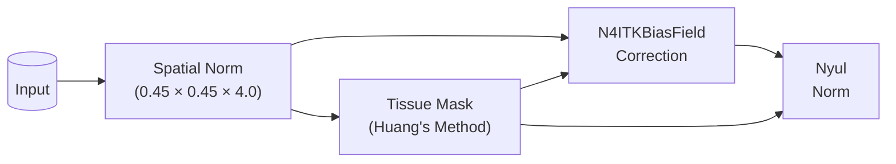

<details>
  <summary>Detailed code</summary>

```python
import os
from pathlib import Path
from mnts.filters.geom import *
from mnts.filters.intensity import *
from mnts.filters.mnts_filters import MNTSFilterGraph
import SimpleITK as sitk

from tqdm.auto import tqdm
from mnts.utils import repeat_zip
from mnts.filters import mpi_wrapper, TypeCastNode

def create_graph() -> MNTSFilterGraph:
    r"""Create the normalization graph"""
    G = MNTSFilterGraph()

    # Add filter nodes to the graph.
    G.add_node(SpatialNorm(out_spacing=[0.4492, 0.4492, 4]))
    G.add_node(HuangThresholding(closing_kernel_size=10), 0, is_exit=True)  # Use mask to better match the histograms
    G.add_node(N4ITKBiasFieldCorrection(), [0, 1])
    G.add_node(NyulNormalizer(), [2, 1], is_exit=True)
    G.add_node(LinearRescale(mean=5000., std=2500.), [3, 1])
    G.add_node(TypeCastNode(sitk.sitkUInt16), 4, is_exit=True)
    G.add_node(SignalIntensityRebinning(num_of_bins=256, quantiles=[0.01, 0.99]), [4, 1], is_exit=True)
    G.add_node(SignalIntensityRebinning(num_of_bins=256, quantiles=[0.01, 0.99]), [3, 1], is_exit=True)
    return G
```

</details>

The radiomics were done over the images output to `04.NyulNormBinned`. Note that you are adviced to check if the tissue mask generated automatically using Huang's method is valid.

## Pyradiomics setting

The extraction setting can be done using yaml files. There is a default setting located in this [file](./pyradiomics_setting-v2.yml). The default setting was customized for NPC Axial MRI and is briefly introduced:

### v1

```yaml
imageType:
  Original: {}
  LBP2D:
    lbp2DRadius: 0.4492
    lbp2DMethod: 'default'
    force2D: True
  LBP3D:
    lbp3DIcosphereRadius : 0.4492
  LoG:
    sigma: [0.4492, 0.4492, 0.4492]
  Gradient: {}
  Exponential: {}

featureClass:
  firstorder:
    - Energy
    - Entropy
    - Kurtosis
    - Maximum
    - MeanAbsoluteDeviation
    - Mean
    - RobustMeanAbsoluteDeviation
    - RootMeanSquared
    - Skewness
    - Uniformity
    - Variance
  shape:
  glcm:
  glrlm:

setting:
  resampledPixelSpacing: [0.4492, 0.4492, 0.4492]
  preCrop: True

```

### v1-Flowchart

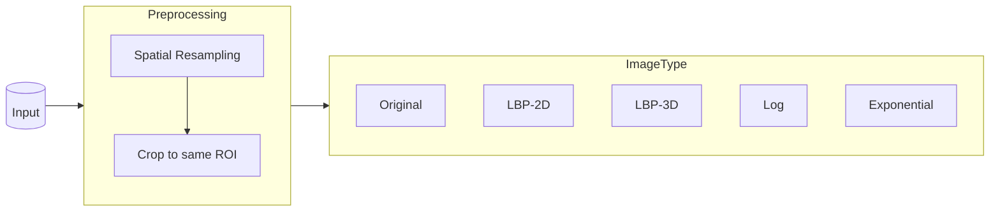

### v2

Update because it is found that default intensity binning of pyradiomics is not making sense in our application.

```yaml
imageType:
  Original: {}
  LBP2D:
    lbp2DRadius: 0.9
    lbp2DMethod: 'default'
    force2D: True
  LBP3D:
    lbp3DIcosphereRadius : 0.9
  LoG:
    sigma: [0.4492, 0.4492, 0.4492]
  Gradient: {}
  Exponential: {}

featureClass:
  firstorder:
    - Energy
    - Entropy
    - Kurtosis
    - Maximum
    - MeanAbsoluteDeviation
    - Mean
    - RobustMeanAbsoluteDeviation
    - RootMeanSquared
    - Skewness
    - Uniformity
    - Variance
  shape:
  glcm:
  glrlm:

setting:
  resampledPixelSpacing: [0.4492, 0.4492, 0.4492]
  binWidth: 1 # <-- this is the only difference.
  preCrop: True
```


# Model Building

## Usage

```bash
python model_building.py
```

## Features Filtration

The extracted features contains a lot of noises, these noises can generally be a result of or show symptoms of:

* Floating point error due to data type (e.g., Int16, Int32)
* Most subjects have identical features. (e.g, all intensity minimum are naturally 0 because of the intensity binning)
* Features are too sensitive to the changes in acquisition parameters (e.g., spacing)
* Divided by zero error

Also, the robustness of radiomics features could be sensitive to the segmentation such that slight difference in segmentation could lead to huge difference in the radiomics feature computed.

Therefore, an initial features filtration might help trim down the number of features and reduce the risk of overfitting, even though it could lead to a drop in the performance.

### Filtration based on repeatability

As we would like the maximized repeatability for the final product model, repeatability should be ensured step by step:

1. Ensure repeatability when there are slight changes in segmentation
2. Ensure that there are no features that are identical
3. Check if there are any variables that has a very low variance, likely to be all 0 or 1.

Note that ordinary least square methods (OLS; e.g., LASSO) does not assume normality of features.

### Flow chart

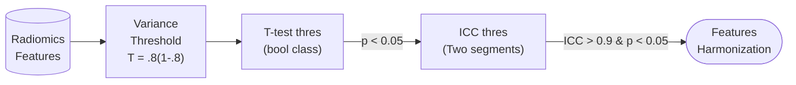

## Features harmonization

Although the images are already normalized, it is statistically advantageous to normalize the features across the data points (i.e., the subjects). Different features tends to have different magnitude range, which means different means and std assuming they take normal distribution. This could affect the loss manifold during training and make it hard to treat all features equally. Therefore, it is common to linearly normalize the features before actually training a model with them.

### Common methods

Essentially the same method to normalize image intensity range can be used here, such as:

* ZScore
* ComBat

```python
from sklearn.preprocessing import StandardScalar
data = StandardScalter().fit_transform(data)
```

## Model building strategy

### Understanding the risk of overfitting

Overfitting is one of the major issue in machine learning. There ain't really a solution or a standard method to solve it, but measures were proposed to mitigate it. In essence, overfitting risk associates with model complexity and the sample size. If the model complexity is too high compared to the sample size, it might learn features that characterize only the training data rather than the problem of interest.

Model complexity generally have to do with the number of trainable parameters in a model (in most conventional ML methods, the number of input features depends the trainable parameters and hence, the model complexity). However, there are currently no established method to quantify overfitting, nor to solve this problem, only to mitigate it.

#### Methods to mitigate overfitting

1. Using a validation set in combination of early stopping
2. Reduce the model complexity, i.e., either reduce the number of features or number of trainable parameters.
3. Increase the sample size (*You don't say*).
4. Noise injection during training.
5. Using boosting techniques[^2] (But the understanding as to why this helps is unclear[^1]. Also boosting works worse if there are noises, so it is not recommended to use it with noise injection.)

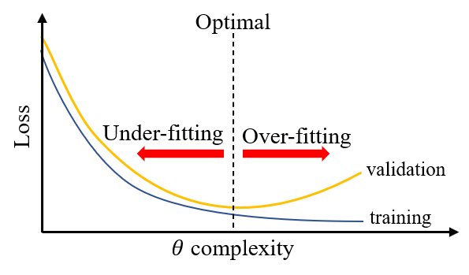

Plot describing the use of a validation dataset during training to identify the optimal points for early stopping.

### Choosing a model/pipeline

Machine learning is an empirical science, such that making arbitrary decisions without solid mathematical or other evidence are unavoidable at some points. It is not uncommon where the choices of using a certain model is challenged. For instance, the ground of using LASSO over Ridge or Elastic Net is not that solid unless all these method were tested (although it should be note that Elastic Net can be considered more advance than both LASSO and Ridge in some perspective). In addition, each model has different hyper-parameters to tune for. This means there are countless combinations to try before we claim one of them is the best by performing rigorous brute force experiments. Obviously, that is impractical.

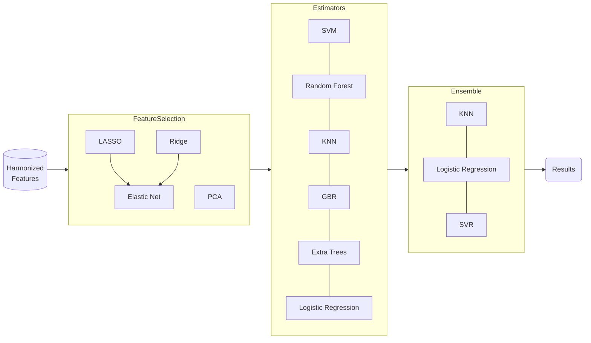

For instance, just from this graph, there are 60 possible combinations, and each of these models has its own hyper-parameters to tune, this crank up to a daunting number of runs. In addition, running hyper-parameter tuning requires K-fold cross-validation to get a more reliable result. It is simply impossible to try all the combinations. Thus, we need a systematic way to select from these models, while subject the constrain of avoiding overfitting with the optimal performance. Of course, there are currently no standard to this, people just brute force their way through by trying as many combination as possible, or ignore the problem entirely and given up on supporting their arbitrary decisions with any sort of subjective evidence.

#### Workflow

The model building should be divided into two parts:

1. Tune individual estimator's hyper-parameters alone.
2. Using the learnt hyper-parameters, construct different combinations of pipelines (models).
3. For each model, train and evaluate the model performance using nest-K-fold cross-validation with holdout plus.
4. Construct the final model from the whole dataset using the final selected model construction method.

The experiment table should look like this:


| Trials  | Pipeline 1 | Pipeline 2 | ... |
| --------- | :----------: | :----------: | :---: |
| Trial 1 | mean AUCs | mean AUCs | ... |
| Trial 2 |     --     |     --     | ... |
| ...     |    ...    |    ...    | ... |

The experiments should be based on this framework. Multiple trials should be ran using this flow.

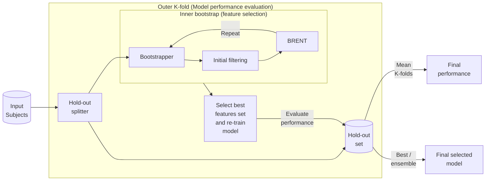

#### TODO

* [x] Build a bunch bunch of pipelines and get a list of best hyper-parameters
  * [x] SVM
  * [x] Logistic regression
  * [x] Random forest
  * [x] K nearest neighbour
  * [X] Elastic Net
    * For each run, record the rank of coefficients magnitude, average the ranks across several trials and us only 10 features

### Supervised feature selection

#### Repeated Elastic Net Technique (RENT)[^3]

Based on the idea of ensembles, the authors focused the distribution of features weights (i.e., coefficients) of elastic net regularized models. The criteria for features selection in RENT were based on:

1. How often is a features selected? ($\tau_1$)
2. To which degree do the feature weights alternate between positive and negative values? ($\tau_2$)
3. Are feature weights significantly unequal to 0? ($\tau_3$)

##### RENT workflow 

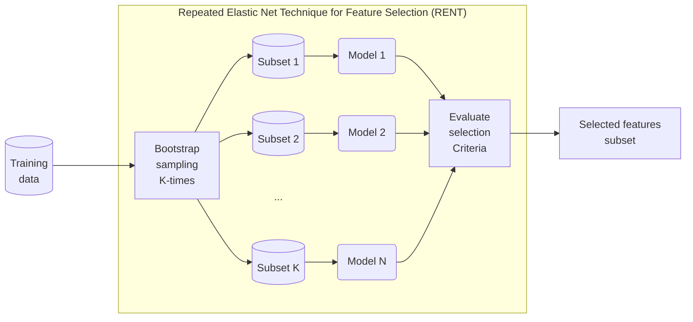

##### Weakness

The selection power of this method wasn't enough, after the initial filtering, the features left all have strong t-test performance between the two class.  The three selection criteria wasn't enough as the coefficients of the remaining features all showed high $\tau_1$ and $\tau_3$. Although $\tau_2$ can be used to filter away around 60% of features, different features were kept each time RENT is performed on the dataset.

Therefore, for selection of features among t-test significant features, RENT isn't producing repeatable enough features.

Also, it is not rare that the some of the K models trained couldn't converge, it is unsure if this is accounted for or not. While this is related to the non-optimal alpha and L1-ratio, this is still problematic.

> **Notes:** Later it is found that while `RENT_Classification` showed unstableness, `RENT_Regression` seems to show better selection stability. However, when the outer K-fold is repeated again, the selected features were not always the same. Furthermore, after the features were recalculated from the original data together with some added features, the selected features changes, so it is still sensitive to the data some how but more stable than doing nothing. Therefore, we proposed to boost the elastic net prior to evaluating the three selection criteria.

##### Usage

```python
from RENT import RENT
# Define setting for RENT
model = RENT.RENT_Classification(data=train_data, 
                                 target=train_labels, 
                                 feat_names=train_data.columns, 
                                 C=[10], # 1/alpha; needs to be a list
                                 l1_ratios=[0.5], # needs to be a list
                                 autoEnetParSel=False, # if not set to false the C/L1 list is permuted
                                 poly='OFF',
                                 testsize_range=(0.25,0.25),
                                 scoring='mcc',
                                 classifier='logreg',
                                 K=100,
                                 random_state=0,
                                 verbose=1)
model.train()
selected_features = model.select_features(tau_1_cutoff=0.9, tau_2_cutoff=0.9, tau_3_cutoff=0.975)
```

##### Mathematical base of boosting RENT

We use AdaBoost to boost the elastic net


# Visualization

## T-test difference

The T-test difference can be visualized by plotting the distributions of all features:

```python
import seaborn as sns

# Data columns are patients, rows are features
data = data.melt(id_vars=["Features", "FeatureGroup"])
sns.displot(data, x="values", row="Features", col="FeatureGroup", kind='kde')
```

## Model power

To visualize the predictive power of the selected features, we can project the N-D features onto a 2D space and perform a scatter plot. However, you might still notice an appreciable overlap. This is because the projection flattens $N-2$ of the dimensions such that seperations of the two classes along these flattened dimensions cannot be observed.


## Effect of estimator hyper-parameters

Grid-search was performed for the same problem using a 5-fold setting such that each set of hyper-parameters were trained for 5 times and the plots here is the mean and 95% confidence interval bound of the AUC performance.

From these graph, seems like using Elastic Net with $\alpha = 0.02$ and $\text{L1 ratio} = 0.5$. [(Ref)](#Elastic-Net)

### LASSO

* alpha

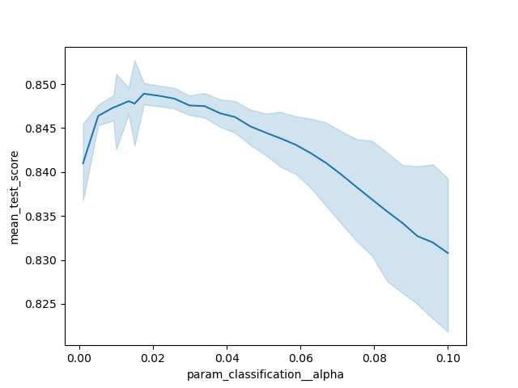

### Elastic Net

* Alpha and L1-ratio repeatedly tested for 15 times in a 10-fold setting, optimal at alpha ~ 0.02 and L1 ratio ~ 0.5

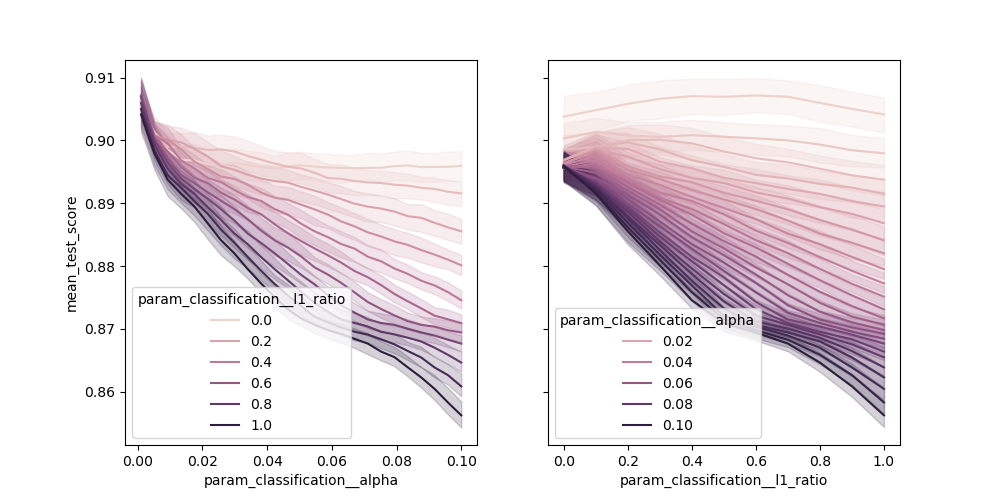

* L1-ratio

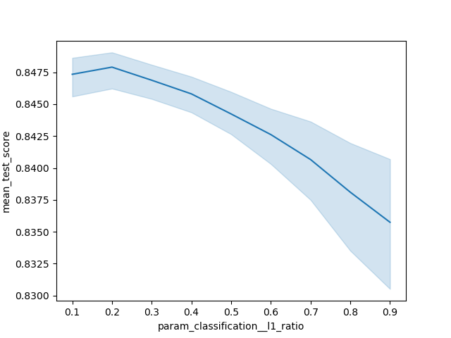

### Support Vector Regression

* Degree of polynomial (when kernel "Poly" is used)

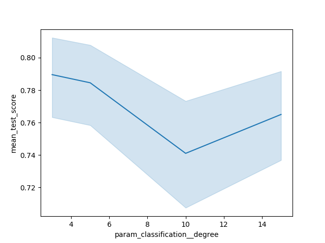

* C

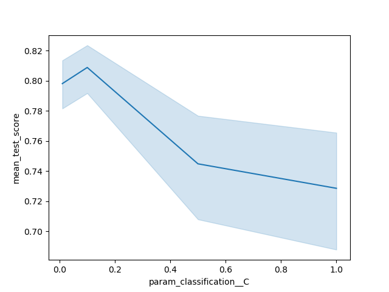

# Footnotes

[^1]: [MIT OpenCourse Artificial Intelligence, Fall2010](https://www.youtube.com/watch?v=UHBmv7qCey4#t=48m38s)

[^2]: [The Boosting Margin, or Why Boosting Doesn’t Overfit](https://jeremykun.com/2015/09/21/the-boosting-margin-or-why-boosting-doesnt-overfit/) (To be more accurate, it does overfit but is less likely to overfit.)

[^3]: Jenul, Anna, et al. "[RENT--Repeated Elastic Net Technique for Feature Selection.](https://arxiv.org/abs/2009.12780)" *arXiv preprint arXiv:2009.12780* (2020).
